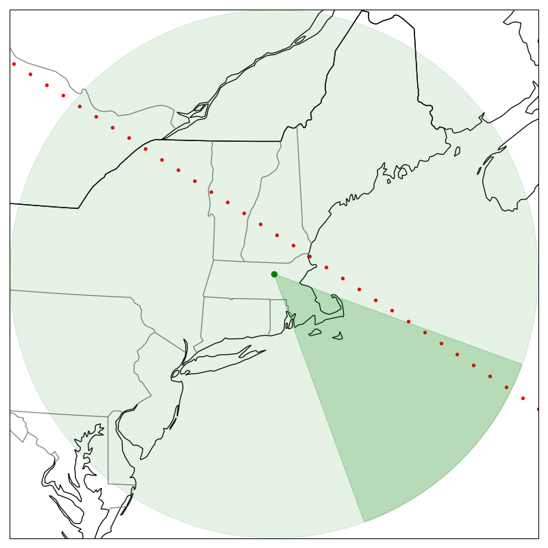
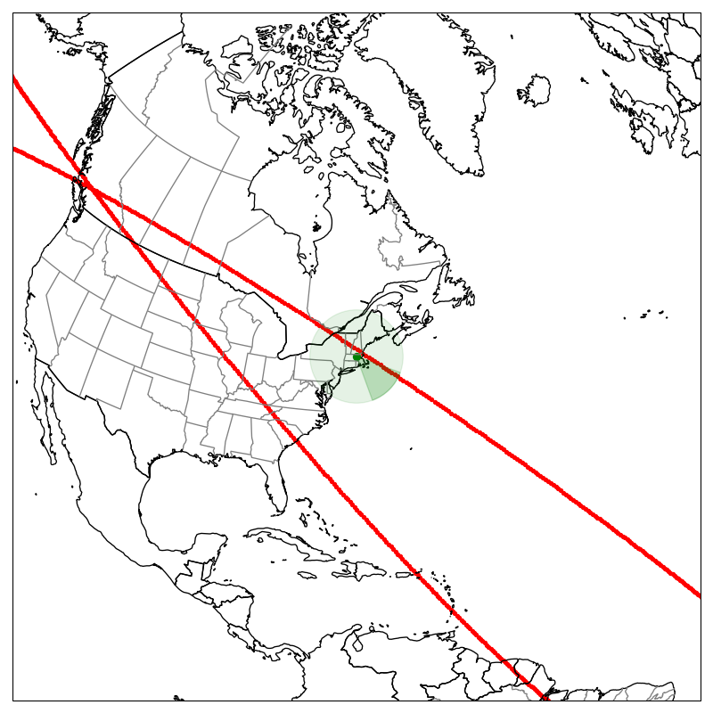
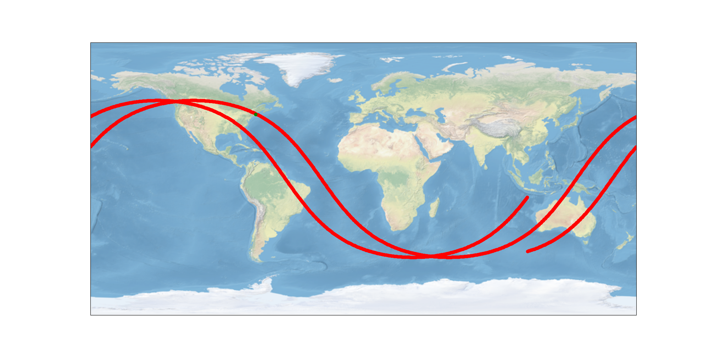
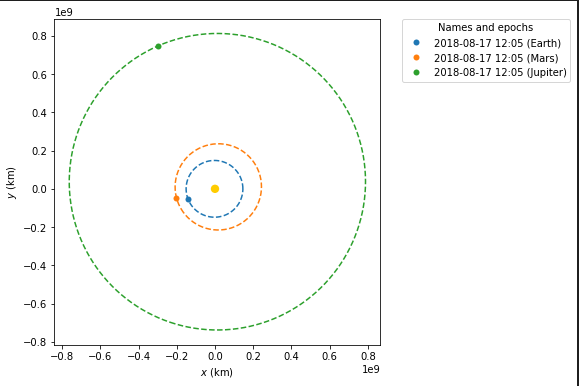

# Astronomy & Satellite Tracking
Miscellaneous astronomy projects.

Orbit tracking, satellite tracking, searching for exoplanets, etc
Radio Astronomy and SETI tech signature analysis is elsewhere.

## Satellite Tracking
Given satellite TLE data and a ground-based receiver, plot orbit data and determine when periods of observability.

## Orbitals - Poliastro Notebooks
Plot Static Orbits and Launch Tranjectories

`docker run --gpus all --cap-add=SYS_ADMIN --rm -v /dev/shm:/dev/shm -v /home/jeffrey/repos/astronomy/code:/code -it --entrypoint bash astronomy:latest`

### TODO List 
 - Docker env with Shapely bug
    `pip uninstall shapely`
    `pip install --no-binary :all: shapely`
 - Calculate radar coverage at LEO (radius)
 - API for updated TLE
 - Find overlap of time when we have coverage
 - Satellite altitude plot vs epoch time
